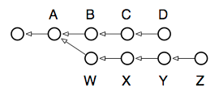
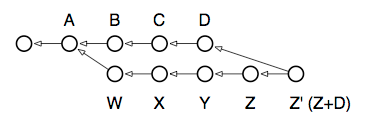
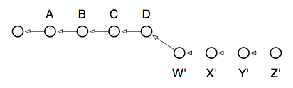

# Branching and the power of rebase

One of Git’s most capable commands for manipulating commits is the innocently-named rebase command. Basically, every branch you work from has one or more “base commits”: the commits that branch was born from. Take the following typical scenario, for example. Note that the arrows point back in time because each commit references its parent(s), but not its children. Therefore, the D and Z commits represent the heads of their respective branches:



In this case, running branch would show two “heads”: `D` and `Z`, with the common parent of both branches being A. The output of show-branch shows us just this information:

```bash
$ git branch
  Z
* D

$ git show-branch
! [Z] Z
 * [D] D
--
 * [D] D
 * [D^] C
 * [D~2] B
+  [Z]Z
+  [Z^]Y
+  [Z~2] X
+  [Z~3] W
+* [D~3] A
```

Reading this output takes a little getting used to, but essentially it’s no different from the diagram above. Here’s what it tells us:

* The branch we’re on experienced its first divergence at commit `A` (also known as commit `D~3`, and even `Z~4` if you feel so inclined). The syntax `commit^` is used to refer to the parent of a commit, while `commit~3` refers to its third parent, or great-grandparent.
* Reading from bottom to top, the first column (the plus signs) shows a divergent branch named `Z` with four commits: `W`, `X`, `Y` and `Z`.
* The second column (the asterisks) show the commits which happened on the current branch, namely three commits: `B`, `C` and `D`.
* The top of the output, separated from the bottom by a dividing line, identifies the branches displayed, which column their commits are labelled by, and the character used for the labeling.

The action we’d like to perform is to bring the working branch `Z` back up to speed with the main branch, `D`. In other words, we want to incorporate the work from `B`, `C`, and `D` into `Z`.

In other version control systems this sort of thing can only be done using a “branch merge”. In fact, a branch merge can still be done in Git, using `merge`, and remains needful in the case where `Z` is a published branch and we don’t want to alter its commit history. Here are the commands to run:

```bash
$ git checkout Z # switch to the Z branch
$ git merge D # merge commits B, C and D into Z
```

This is what the repository looks like afterward:



If we checked out the `Z` branch now, it would contain the contents of the previous `Z` (now referenceable as `Z^`), merged with the contents of `D`. (Though note: a real merge operation would have required resolving any conflicts between the states of `D` and `Z`).

Although the new `Z` now contains the changes from `D`, it also includes a new commit to represent the merging of `Z` with `D`: the commit now shown as `Z’`. This commit doesn’t add anything new, but represents the work done to bring `D` and `Z` together. In a sense it’s a “meta-commit”, because its contents are related to work done solely in the repository, and not to new work done in the working tree.

There is a way, however, to transplant the `Z` branch straight onto `D`, effectively moving it forward in time: by using the powerful rebase command. Here’s the graph we’re aiming for:



This state of affairs most directly represents what we’d like done: for our local, development branch `Z` to be based on the latest work in the main branch `D`. That’s why the command is called “rebase”, because it changes the base commit of the branch it’s run from. If you run it repeatedly, you can carry forward a set of patches indefinitely, always staying up-to-date with the main branch, but without adding unnecessary merge commits to your development branch. Here are the commands to run, compared to the merge operation performed above:

```bash
$ git checkout Z # switch to the Z branch
$ git rebase D # change Z’s base commit to point to D
```

Why is this only for local branches? Because every time you rebase, you’re potentially changing every commit in the branch. Earlier, when `W` was based on ` A`, it contained only the changes needed to transform `A` into `W`. After running rebase, however, `W` will be rewritten to contain the changes necessary to transform `D` into `W’`. Even the transformation from `W` to `X` is changed, because `A+W+X` is now `D+W’+X’` — and so on. If this were a branch whose changes are seen by other people, and any of your downstream consumers had created their own local branches off of `Z`, their branches would now point to the old `Z`, not the new `Z’`.

Generally, the following rule of thumb can be used: use `rebase` if you have a local branch with no other branches that have branched off from it, and use `merge` for all other cases. `merge` is also useful when you’re ready to pull your local branch’s changes back into the main branch.
