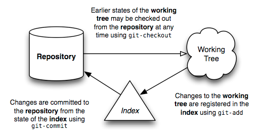

# Introduction

Welcome to the world of Git. I hope this document will help to advance your understanding of this powerful content tracking system, and reveal a bit of the simplicity underlying it — however dizzying its array of options may seem from the outside.

Before we dive in, there are a few terms which should be mentioned first, since they’ll appear repeatedly throughout this text:

* **repository** — A **repository** is a collection of _commits_, each of which is an archive of what the project's _working tree_ looked like at a past date, whether on your machine or someone else's. It also defines HEAD (see below), which identifies the branch or commit the current working tree stemmed from. Lastly, it contains a set of _branches_ and _tags_, to identify certain commits by name.

* **the index** — Unlike other, similar tools you may have used, Git does not commit changes directly from the _working tree_ into the _repository_. Instead, changes are first registered in something called **the index**. Think of it as a way of “confirming” your changes, one by one, before doing a commit (which records all your approved changes at once). Some find it helpful to call it the “staging area”, instead of the index.

* **working tree** — A **working tree** is any directory on your filesystem which has a _repository_ associated with it (typically indicated by the presence of a sub-directory within it named `.git`.). It includes all the files and sub-directories in that directory.

* **commit** — A **commit** is a snapshot of your working tree at some point in time. The state of HEAD (see below) at the time your commit is made becomes that commit’s parent. This is what creates the notion of a “revision history”.

* **branch** — A **branch** is just a name for a commit (and much more will be said about commits in a moment), also called a reference. It’s the parentage of a commit which defines its history, and thus the typical notion of a “branch of development”.

* **tag** — A **tag** is also a name for a commit, similar to a _branch_, except that it always names the same commit, and can have its own description text.

* **master** — The mainline of development in most repositories is done on a branch called “**master**” or "**main**". Although one of these is typically chosen as the default name by convention, the chosen name and branch themselves are in no way special.

* **HEAD** — **HEAD** is used by your repository to define what is currently checked out:
  * If you checkout a branch, HEAD symbolically refers to that branch, indicating that the branch name should be updated after the next commit operation.
  *  If you checkout a specific commit, HEAD refers to that commit only. This is referred to as a detached _HEAD_, and occurs, for example, if you check out a tag name.

* **remote** — This is a reference to a different copy of the same repository located elsewhere, e.g. on another computer. The **remote** repository may be in a different state to the local copy but should always share at least one common ancestor commit. Local and remote repositories use a common commit to diverge from each other, allowing `git` to enable collaborative distributed work.

The usual flow of events is this: After creating a repository, your work is done in the working tree. Once your work reaches a significant point — the completion of a bug, the end of the working day, a moment when everything compiles — you add your changes successively to the index. Once the index contains everything you intend to commit, you record its content in the repository. Here’s a simple diagram that shows a typical project’s life-cycle:

With this basic picture in mind, the following sections shall attempt to describe how each of these different entities is important to the operation of Git.

**LICENSE**: This document is licensed under the [Creative Commons BY 4.0 license](https://creativecommons.org/licenses/by/4.0/legalcode). If you'd like to translate it into other languages, please feel free, so long as you reference this original text.
